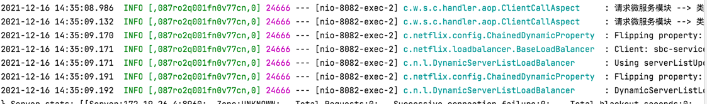

# 引入
使用log-trace，只需要在项目pom文件中引入
```xml
<dependency>
    <groupId>com.wanmi.tools</groupId>
    <artifactId>log-trace-springboot-starter</artifactId>
    <version>0.1.0-RELEASE</version>
</dependency>
```
启动项目就能够在日志中看到

中括号内部有三个数据，逗号分割
* 1 **applicationName**，服务名称
* 2 **traceId** 18位当前调用的唯一性id
* 3 **spanId** 当前调用链，
  * 比如mobile调用order、marketing， 那mobile的spanId=0，order spanId=0.1,marketing spanId=0.2。
  * 如果mobile->order，order->marketing,marketing->goods,marketing->customer，那调用链是
  mobile=0,order=0.1,marketing=0.1.1,goods=0.1.1.1,customer=0.1.1.2
  
# traceId生成规则
traceId组成
```
 ip网段+ip后三位+进程Id+时间戳（毫秒）+0-4096的增量
 2位+2位+3位+11位
```
做的32进制转化

比如traceId=087ro2q001fn0v77cn
* 08：机器网段是8
* 7r：ip后三位是251
* o2q：进程号为24666，因为进程id最多为32767，所以最大是vvv三位足够放的
* 001fn0v77cn：时间戳+增量=1639636508055

# 追踪
现在每个请求都会在response的Header里面存放X-B3-TraceId，所以在前端拿到traceId去后端日志查询即可
